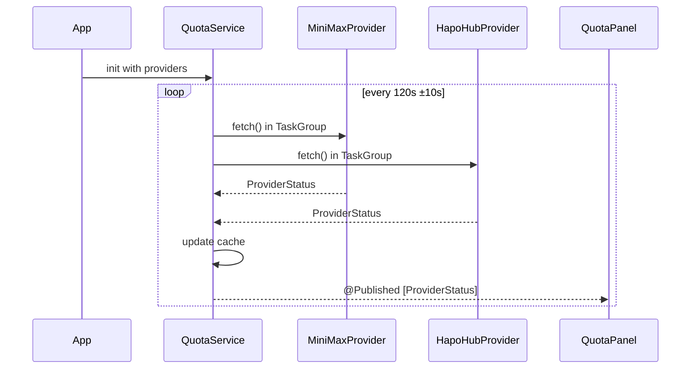
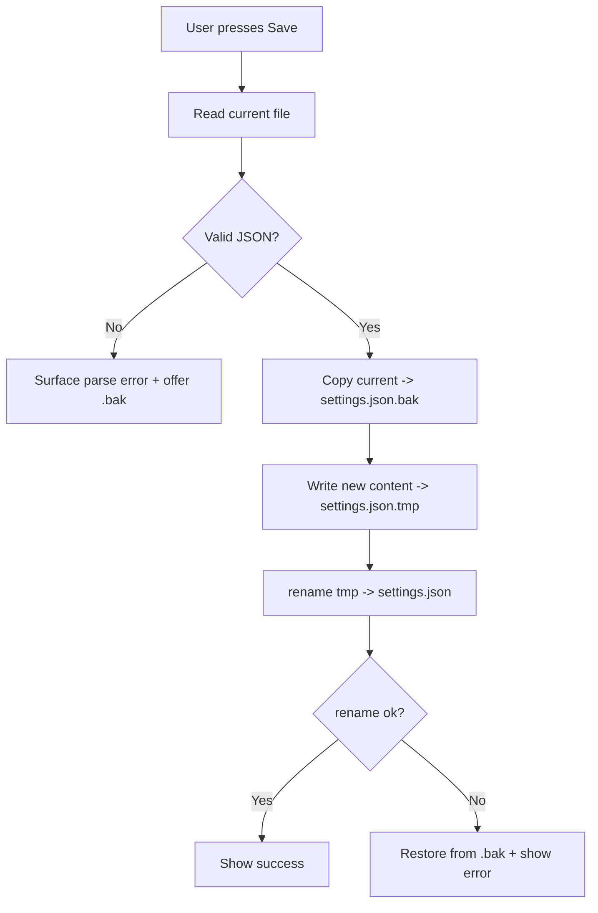

# Design Document — AI Statusbar

## Overview
Native macOS menu bar app (Swift + SwiftUI, `MenuBarExtra`) running on the user's local machine. It tracks AI quota for MiniMax and Hapo Hub via a `QuotaProvider` protocol, polls them every 60s, and surfaces remaining percentage in a popover. It also reads and edits Claude Code `settings.json` at both global and per-project scope with atomic writes and Keychain-stored credentials.

**Users:** BOSS uses this on one personal machine to track multiple AI provider quotas and to switch Claude Code model / base URL / API key without leaving the menu bar.

**Impact:** Greenfield — no existing code to integrate. Creates the entire app from scratch in a fresh Xcode project.

### Goals
- Single-click access to quota + Claude Code config from the menu bar.
- Multiple providers without rewriting polling or UI.
- Secure credential handling (Keychain) and safe config writes (atomic + .bak).
- Personal use, no signing/notarization, macOS 13+.

### Non-Goals
- Code signing, notarization, distribution.
- Multi-user accounts.
- Auto-update mechanism.
- Editing Claude Code hooks (view-only in MVP).
- Generic JSON editor (use typed form fields only).
- Providers beyond MiniMax and Hapo Hub in v1 (extensible via protocol).

## Architecture

### Architecture Pattern & Boundary Map

```mermaid
flowchart TD
  subgraph App
    App[AIStatusbarApp @main]
    MB[MenuBarExtra + Popover]
    App --> MB
  end

  subgraph Views
    PV[PopoverView]
    QP[QuotaPanel]
    CP[ConfigPanel]
    PR[ProviderRow]
    QB[QuotaBar]
    MB --> PV
    PV --> QP
    PV --> CP
    QP --> PR
    PR --> QB
  end

  subgraph Services
    QS[QuotaService]
    CS[ConfigService]
    KS[KeychainService]
  end

  subgraph Models
    PS[ProviderStatus]
    QW[QuotaWindow]
    CSt[ClaudeSettings]
  end

  subgraph Providers
    QPP[QuotaProvider protocol]
    MM[MiniMaxProvider]
    HH[HapoHubProvider]
    MK[MockHapoHubProvider]
    QPP --> MM
    QPP --> HH
    QPP --> MK
  end

  QP --> QS
  CP --> CS
  QS --> QPP
  CS --> CSt
  CS --> KS
  QS -.uses.-> KS
  PR --> PS
  QB --> QW
```

**Selected pattern:** Single-target SwiftUI app, `MenuBarExtra` shell, services as `ObservableObject` shared via `@StateObject` on the App root, providers discovered from a registry.

**Domain boundaries:**
- Providers only know how to fetch + parse — they do not know UI.
- `QuotaService` owns the timer + cache + error isolation.
- `ConfigService` owns atomic writes and `.bak` rotation.
- `KeychainService` is the only thing that touches Security framework.
- Views only render state — no business logic.

**Existing patterns preserved:** none (greenfield).

**Steering compliance:** YAGNI (1 protocol, no premature abstraction); KISS (2 built-in providers, no plugin loader); DRY (provider protocol reused by mock + real).

### Technology Stack

| Layer | Choice / Version | Role in Feature | Notes |
|-------|------------------|-----------------|-------|
| Frontend / UI | SwiftUI + `MenuBarExtra` (macOS 13+) | Popover, panels, bars | `@StateObject` for services |
| Backend / Services | Swift `ObservableObject` + `Task`/`async`/`await` | Polling, file IO, Keychain | No third-party runtime |
| Data / Storage | macOS Keychain + `JSONEncoder`/`JSONDecoder` | Tokens + providers.json + settings.json | Atomic write via temp + rename |
| Networking | `URLSession` (default) | Provider HTTP | TLS validation on |
| Testing | Swift Testing (Xcode 16) / XCTest fallback | Unit + integration | Recorded MiniMax JSON fixture |
| Build | `xcodebuild` | Build the `.app` | No signing for personal use |
| Deployment target | macOS 13.0 | Required for `MenuBarExtra` | Verified on BOSS machine |

## Canonical Contracts & Invariants

| Contract Area | Canonical Decision | Applies To | Must Stay Consistent In |
|---------------|--------------------|------------|------------------------|
| Auth / session | Provider tokens stored only in macOS Keychain under service `AIStatusbar`, account = provider id, class `kSecClassGenericPassword` | All providers | `KeychainService`, provider registry, any UI reading token |
| Transport / entrypoints | Outbound network limited to provider endpoint URLs from `providers.json`; `URLSession` with default TLS | All providers | `MiniMaxProvider`, `HapoHubProvider`, mock provider |
| Data / persistence | `~/Library/Application Support/AIStatusbar/providers.json` is the only app-written file outside Claude Code paths | `QuotaService` registry load | `ConfigService` must not write here |
| Data / persistence | Claude Code `settings.json` writes are atomic (temp + `rename`) and always preceded by a `.bak` copy | Global + per-project | `ConfigService` |
| Deletion / retention policy | Per-project `.bak` and `settings.json.bak` retained indefinitely; provider tokens deleted from Keychain when user removes provider | All persistence | `KeychainService.delete`, `ConfigService` |
| Generated artifacts / runtime outputs | `providers.json` keys: `id, displayName, enabled, baseURL?, authHeaderTemplate?, jsonPath?` | Registry load/save | Same struct reused by all providers |

### Machine-checkable contracts

<!-- contract:QuotaWindow -->
```json
{
  "label": "string",
  "usedPct": "int 0-100",
  "remainingPct": "int 0-100"
}
```

<!-- contract:ProviderStatus -->
```json
{
  "id": "string",
  "displayName": "string",
  "windows": ["QuotaWindow"],
  "lastUpdated": "ISO-8601 datetime",
  "error": "string|null"
}
```

<!-- contract:MiniMaxRemainsResponse -->
```json
{
  "model_remains": [
    {
      "model_name": "string",
      "current_interval_total_count": "int",
      "current_interval_usage_count": "int",
      "current_interval_remaining_percent": "int 0-100",
      "current_weekly_total_count": "int",
      "current_weekly_usage_count": "int",
      "current_weekly_remaining_percent": "int 0-100"
    }
  ]
}
```

## System Flows

### Quota polling


### Save settings.json (atomic + .bak)


## Requirements Traceability

| Requirement | Summary | Components | Interfaces | Flows |
|-------------|---------|------------|------------|-------|
| 1.1, 1.2, 1.3, 1.4 | Menu bar shell + popover | `AIStatusbarApp`, `MenuBarExtra`, `PopoverView` | `App.body` | n/a |
| 2.1, 2.2, 2.3 | Provider protocol | `QuotaProvider`, `QuotaService` | `fetch() throws -> ProviderStatus` | Quota polling |
| 3.1, 3.2, 3.3, 3.4, 3.5 | MiniMax adapter | `MiniMaxProvider`, `KeychainService` | `fetch()` parses `MiniMaxRemainsResponse` | Quota polling |
| 4.1, 4.2, 4.3, 4.4 | Hapo Hub adapter | `HapoHubProvider`, `MockHapoHubProvider` | `fetch()` | Quota polling |
| 5.1, 5.2, 5.3, 5.4, 5.5 | Polling + display | `QuotaService`, `QuotaPanel`, `ProviderRow`, `QuotaBar` | `@Published [ProviderStatus]` | Quota polling |
| 6.1, 6.2, 6.3, 6.4, 6.5, 6.6, 6.7 | Global config edit | `ConfigService`, `ConfigPanel` | `loadGlobal()` / `saveGlobal(_:)` | Save settings.json |
| 7.1, 7.2, 7.3, 7.4 | Per-project config edit | `ConfigService`, `ConfigPanel` | `loadProject(_:)`, `saveProject(_:_:)` | Save settings.json |
| 8.1, 8.2, 8.3, 8.4, 8.5 | Provider persistence | `KeychainService`, `QuotaService` | `loadProviders()`, `saveProviders(_:)` | n/a |
| 9.1, 9.2, 9.3, 9.4 | Build + reachability | `xcodebuild`, all runtime modules | Runtime entrypoint check | n/a |
| 10.1, 10.2, 10.3 | Performance | `MenuBarExtra`, polling timer | Memory + latency budget | n/a |
| 11.1, 11.2, 11.3, 11.4, 11.5 | Security | `KeychainService`, `ConfigService`, providers | TLS, no-log, atomic write | Save settings.json |
| 12.1, 12.2, 12.3, 12.4 | Reliability | `QuotaService`, `ConfigService` | Error isolation, fallback defaults | Quota polling |

## Components and Interfaces

| Component | Domain/Layer | Intent | Req Coverage | Key Dependencies | Contracts |
|-----------|--------------|--------|--------------|-------------------|-----------|
| `AIStatusbarApp` | App | `@main` entry; installs `MenuBarExtra` | 1.1–1.4 | All services | n/a |
| `QuotaService` | Service | 60s polling, parallel fetch, cache, publish | 2.1–2.3, 5.1–5.2 | `KeychainService`, providers | `ProviderStatus` |
| `ConfigService` | Service | Read/write `settings.json` atomic | 6.1–6.7, 7.1–7.4, 11.5, 12.2 | `KeychainService` (for API key write-back) | `ClaudeSettings` |
| `KeychainService` | Service | Wrap `kSecClassGenericPassword` | 8.2–8.5, 11.1, 12.4 | Security framework | n/a |
| `QuotaProvider` (proto) | Provider | Quota contract | 2.1 | URLSession | `ProviderStatus` |
| `MiniMaxProvider` | Provider | MiniMax `/v1/token_plan/remains` | 3.1–3.5 | URLSession, `KeychainService` | `MiniMaxRemainsResponse` → `ProviderStatus` |
| `HapoHubProvider` | Provider | Hapo Hub endpoint (real or mock) | 4.1–4.4 | URLSession, `KeychainService` | `ProviderStatus` |
| `PopoverView` | View | Hosts panels | 1.2, 1.4 | `QuotaService`, `ConfigService` | n/a |
| `QuotaPanel` | View | Provider rows | 5.1–5.5 | `QuotaService` | n/a |
| `ConfigPanel` | View | Form for global + per-project | 6.1–6.7, 7.1–7.4 | `ConfigService` | n/a |
| `ProviderRow` | View | One provider's windows | 5.3–5.5 | `QuotaService` | `ProviderStatus`, `QuotaWindow` |
| `QuotaBar` | View | Colored progress bar | 5.4 | `ProviderRow` | `QuotaWindow` |

### AIStatusbarApp

| Field | Detail |
|-------|--------|
| Intent | SwiftUI `@main`; installs `MenuBarExtra` with popover containing the panels |
| Requirements | 1.1–1.4 |
| Owner | App layer |

**Responsibilities & Constraints**
- Set `LSUIElement = true` in Info.plist to hide the Dock icon.
- Construct `QuotaService` and `ConfigService` once and pass via `@StateObject`.
- The popover content is a `PopoverView` bound to the same services.

**Dependencies**
- Outbound: `QuotaService`, `ConfigService`, `KeychainService`, all views

### QuotaService

| Field | Detail |
|-------|--------|
| Intent | 60s polling of providers, parallel fetch, error isolation, `@Published` cache |
| Requirements | 2.1–2.3, 5.1–5.2, 12.1 |
| Owner | Service layer |

**Service Interface**
```swift
@MainActor
final class QuotaService: ObservableObject {
  @Published private(set) var statuses: [ProviderStatus] = []
  func start() async
  func stop()
  func refresh() async                // manual refresh hook
  func addProvider(_ p: QuotaProvider) // for Settings
  func removeProvider(id: String)
}
```

- Preconditions: providers list non-empty; keychain reachable (else `error: "Chưa cấu hình token"`).
- Postconditions: `statuses` always reflects latest fetch attempt per provider.
- Invariants: a failing provider never crashes the loop; `statuses` array length == number of enabled providers.

### ConfigService

| Field | Detail |
|-------|--------|
| Intent | Read/write Claude Code global `settings.json` with atomic writes and 3-deep ring `.bak` |
| Requirements | 6.1–6.7, 11.1, 11.5, 12.2 (per-project editing deferred to v2) |
| Owner | Service layer |

**Service Interface**
```swift
@MainActor
final class ConfigService: ObservableObject {
  func loadGlobal() throws -> ClaudeSettings
  func saveGlobal(_ s: ClaudeSettings) throws
  func activePath: URL { get }                    // always ~/.claude/settings.json
  var lastError: String? { get }
}
```

- Preconditions: caller has filesystem permission to `~/.claude/`.
- Postconditions: on `save`, on-disk file is semantically equal to `s` (key order may differ — see Implementation Notes).
- Invariants: `.bak`, `.bak.1`, `.bak.2` ring always reflects the last 3 successful writes; the active `.bak` is validated as parseable JSON before being trusted on restore.

**Implementation Notes**
- **ANTHROPIC_API_KEY path**: when the form binds `env.ANTHROPIC_API_KEY`, the raw value is `KeychainService.save(account: "anthropic", secret: <value>)`. The JSON file stores the literal placeholder `KEYCHAIN_REF:AIStatusbar/anthropic` for that key. BOSS is responsible for resolving the placeholder before launching Claude Code (e.g. via a shell wrapper or `env` substitution in his own scripts). The form never round-trips the raw value through the JSON file.
- **Atomic write**: write new content to `settings.json.tmp` *in the same directory* (never `NSTemporaryDirectory()` — guarantees atomicity on the same filesystem, sidestepping `EXDEV` from Finding F10 which is rejected), then `FileManager.replaceItemAt(_:withItemAt:)` to swap; on failure, copy `.bak` back.
- **Ring rotation**: before each write, validate `.bak` parses as JSON; if yes, rename `.bak` → `.bak.1`; if `.bak.1` exists, rename it → `.bak.2`; if `.bak.2` exists, delete it; then copy current file → `.bak`. If `.bak` does not parse, the rotation aborts and BOSS is warned.
- **JSON preservation**: use `JSONSerialization.jsonObject(_:options: [.mutableContainers])` for read-modify-write so unknown keys survive. **Key order is not preserved** (R11.5 wording updated: "semantic equality, not byte equality"). A test asserts a sample config with `hooks`, `mcpServers`, and `$schema` round-trips with all values intact, regardless of order.
- **Symlink safety**: `URL.resolvingSymlinksInPath()` is applied before read and write; if the resolved path differs from the user-supplied path, BOSS is warned.

### KeychainService

| Field | Detail |
|-------|--------|
| Intent | Save / read / delete provider tokens AND `env.ANTHROPIC_API_KEY` in macOS Keychain |
| Requirements | 8.2–8.5, 11.1, 11.2, 12.4 |

**Service Interface**
```swift
enum KeychainError: Error { case unhandled(OSStatus), itemNotFound, accessDenied }
struct KeychainService {
  static let service = "AIStatusbar"
  func save(account: String, secret: String) throws
  func read(account: String) throws -> String          // throws KeychainError.itemNotFound
  func delete(account: String) throws
}
```

- Provider tokens are stored under `account = <provider id>` ("minimax", "hapo", …).
- `env.ANTHROPIC_API_KEY` is stored under `account = "anthropic"`.
- `errSecItemNotFound` → `KeychainError.itemNotFound` (UX: "Chưa cấu hình token").
- `errSecAuthFailed` / `errSecInteractionNotAllowed` → `KeychainError.accessDenied` (UX: "Keychain locked — click to retry", surfaced in popover, not per-row).

### QuotaProvider protocol

```swift
protocol QuotaProvider: AnyObject {
  var id: String { get }
  var displayName: String { get }
  func fetch() async throws -> ProviderStatus
}
```

### MiniMaxProvider

- Endpoint: **`https://api.minimax.io/v1/token_plan/remains`** (compile-time constant, not configurable via `providers.json` — Finding F2)
- Header: `Authorization: Bearer <Keychain.read("minimax")>`
- Decoder: tolerates extra fields, requires `model_remains[0]`.
- Returns 2 `QuotaWindow` items as per contract.
- 401/403 → `error: "Token bị từ chối — kiểm tra loại key (inference key, không phải Subscription Key)"` (Finding F6)
- `URLSession` is injected via `init(session: URLSession = .shared, keychain: KeychainService)` so tests can use `URLSession(configuration: .ephemeral)` with `protocolClasses` for stubbing (Finding F5).

### HapoHubProvider

- Configuration (from `providers.json`):
  ```json
  {
    "id": "hapo",
    "displayName": "Hapo AI Hub",
    "baseURL": "TODO_BOSS",
    "authHeaderTemplate": "Bearer {token}",
    "jsonPath": "data.quota.remaining"
  }
  ```
- When `baseURL == "TODO_BOSS"`, factory returns `MockHapoHubProvider` so UI runs.
- Real implementation is a thin URLSession call that resolves `jsonPath` via `JSONSerialization` (key path of dot-separated segments).

## Data Models

### Domain Model

```swift
struct QuotaWindow: Identifiable, Codable, Equatable {
  let id: UUID = UUID()
  let label: String
  let usedPct: Int
  let remainingPct: Int
}

struct ProviderStatus: Identifiable, Equatable {
  let id: String
  let displayName: String
  let windows: [QuotaWindow]
  let lastUpdated: Date
  let error: String?
}
```

### Physical Data Model

| File | Format | Owner | Read by | Written by |
|------|--------|-------|---------|------------|
| `~/Library/Application Support/AIStatusbar/providers.json` | JSON, top-level `{ providers: [...] }` | App | `QuotaService` | Settings UI |
| `~/.claude/settings.json` | JSON, Claude Code schema | Claude Code + App | `ConfigService` | `ConfigService` |
| `~/.claude/settings.json.bak` | Mirror of last good file | App | `ConfigService` | `ConfigService` on save |
| macOS Keychain `AIStatusbar` | Generic password items | App | `KeychainService` | `KeychainService` |
| `<project>/.claude/settings.json` | JSON, Claude Code schema | Claude Code + App | `ConfigService` | `ConfigService` |
| `<project>/.claude/settings.json.bak` | Mirror | App | `ConfigService` | `ConfigService` on save |

### Cross-Service Data Management
- App never reaches into `~/.claude/agents/`, `~/.claude/projects/<id>/.../*.jsonl`, or other Claude Code state. It only touches `settings.json` (and `.bak`).

## Error Handling

### Error Strategy
- All `fetch()` calls are wrapped in `do/catch` inside `QuotaService`; the `catch` produces a `ProviderStatus` with `error` set and `windows: []`.
- All file IO errors in `ConfigService` are returned to the caller as a typed `ConfigError` and surfaced in a banner.
- Keychain errors: `errSecItemNotFound` → "Chưa cấu hình token" UX; any other status → "Keychain error" with `OSStatus`.

### Error Categories and Responses
- **Network non-2xx (MiniMax / Hapo):** record status code + body snippet (truncated) in `error`.
- **Network unreachable / timeout:** record `URLError` code in `error`.
- **Keychain locked:** show banner; providers report "Chưa cấu hình token".
- **settings.json invalid JSON:** refuse to load, offer to open `.bak`; do not overwrite.
- **settings.json write fails:** restore from `.bak`, surface error.

### Monitoring
- Debug-only `os_log(.debug, ...)` with category `quota` / `config`. Never log token bytes.
- A `DEBUG_REACHABILITY` flag in Debug builds adds a row in the popover footer listing each provider's last call timestamp.

## Testing Strategy

### Unit Tests
- `MiniMaxProviderParserTests`: 4 cases — happy path (2 windows), missing `model_remains`, missing percent fields, malformed JSON.
- `HapoHubProviderTests`: 3 cases — mock returns fixed windows, real returns 2xx parsed, real returns non-2xx error.
- `ConfigServiceAtomicWriteTests`: 3 cases — happy save, write failure restores `.bak`, JSON preservation of unknown keys.
- `KeychainServiceTests`: 2 cases — round-trip a fake token, read missing item throws `itemNotFound`.

### Integration Tests
- `QuotaServicePollingTest`: with 2 fake providers, run loop 2 cycles and assert `statuses` updates.
- `ConfigServiceGlobalFileTest`: write to a temp dir, simulate Claude Code consumer reading back and assert equality.

### Manual / Smoke
- `xcodebuild` produces runnable `.app`; launch it; menu bar icon appears; click → popover opens; refreshes every minute.

## Security Considerations

- **Threats**: token leak in logs / on disk; tampered settings.json breaking Claude Code; fake gateway harvesting tokens.
- **Controls**:
  - Keychain-only token storage; explicit redaction in `print` / `os_log` calls.
  - Atomic write with `.bak` so partial writes never replace the file.
  - `URLSession` with default TLS validation; no `allowsExpiredCertificates` override.
  - No auto-fill or pasteboard echo of tokens in UI (password `SecureField`).

## Performance & Scalability

- Single-user, local app. No scaling concerns.
- Targets: ≤ 50 MB resident at idle; popover opens ≤ 200 ms; poll cycle ≤ 2 HTTP calls.
- Cache: `statuses` array is the only state; no on-disk cache (each poll is fresh).

## Migration Strategy

- None for v1 (no prior version). Future migrations gated on `providers.json` `version` field if schema changes.

## Supporting References

- MiniMax token plan JSON shape — `specs/ai-statusbar/research.md` (sourced from MiniMax issue #48)
- CodexBar architecture — `docs/system-architecture.md` (sourced from github.com/steipete/CodexBar)
- Apple Keychain Services — Apple developer docs (linked in `research.md`)
